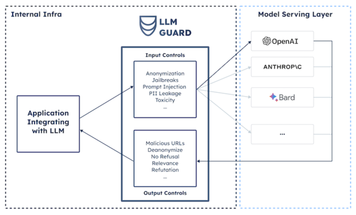

## Runtime
```
Use LLM like a reasoning engine. All the tools that contribute to agent and interact with LLM, they make multiple calls to LLM sequentially. This happen to increase wait time as every output of the node is the input for another one.
To reduce the wait time and speed up the overall response time we can use LLM cache (Redis/DynamoDB) or Semantic cache (GPT cache).
```

## Context Window
```
Every time a node tries to perform reasoning with LLM, large amount of prompts get generated. Most of the LLMs can handle 32k tokens, this may sounds like a huge number but in real world application this figure can be surpassed very easily.
That is why we can execute only limited number of steps due to context window. Now, we know that models like Claude by Anthropic can handle 100k tokens, but this may create another problem that LLM will loose track of the tokens in the middle. 
This problem is known as 'Lost In The Middle'. 
```

## Hallucinations
```
If an LLM doesn't generate response that is relevant to the question asked, this situation is known as Hallucination.
This happens because the LLM is calucalting the probability of the correct token one after another. RAG is the best way to reduce hallucination, because the context can be grounded into LLM while querying it.
LLMs are statistical in nature, that means the work on probabilities to find out correct answer. For LLM, choosing correct answer is equivalent to choosing correct tool.

Let's say P(correct_response) = 0.9
If this is being done for one node then it's fine, but what if there are 6 nodes in the graph that are executed sequentially.

P(correct_response_overall) = 0.9 * 0.9 * 0.9 * 0.9 * 0.9 * 0.9
                            = Approx. 0.54
                            
The more the number of tasks, the lower is the probability of getting the correct response. Fine tuning is one of the way to fix this issue.
Either this should be happen at RAG by implementing critiques and reflections or at the LLM.                              
```

## Fine Tuning
```
Cutomize your LLM on the tools of action. Example if your RAG needs to call and API to get the response, instead of doing it at the RAG level burn this in your LLM. This will correct the rersponse probability over 90%. 
Fine tune yor LLM for the tools that agent will use.
```

## Cost Optimization
```
The LLM services charge based on tokens that are send and recieve by LLM. Agents usually send and recieve tokens in millions that spike the overall bill of the LLM service.
Example, GPT-4 has excellent reasoning capability, but it is slow and super expensive. That's why using it in production is not financially viable. 
To fix this issue use semantic cache like GPTCache etc. intead of writing redundant calls directly to LLM or use RAG for tools of action. 
```

## Response Validation
```
Although we use LLM for the tool selections or response generation. But, we have to verify it's respone as what if the response generated is not in the correct format and it will mess up the whole application.
To test this is a complicated task, and I don't know about any robust solution so far. 
```

## Security
```
Agentic applications use LLM capabilities to execute different tasks like DB operations, API calls etc. On a bad day, a malicious user can hijack the prompt using prompt injection or can gain access to the API_KEY of the tools.
If we try to make our DB proprietary and don't expose it, then it will become difficult to become part of LLM community and would not be able to evolve with LLM.
Security is one big concern and the application must adhere to the Pricipal Of Least Concern (POLA).
```


```
Tools must be given minimum required permissions, for that we plugin gaurd rails in place to not allow malicious prompts using open-source solutions like LLM Gaurd.
```

## Overkilling
```
Agents are good only when there are indeterministic steps to be executed in a sequence. If it is determined
that which workflow needs to be executed to get the output then we can simply code it. Before implementing the 
agent always pivot on finding out if the response can be achieved by deploying a deterministic piece of code.
```
