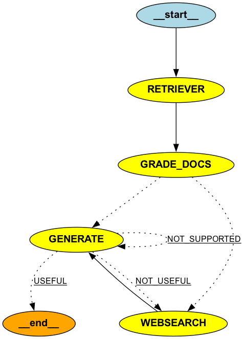

# Building a Corrective RAG System with LangGraph: Enhanced with Web Search

In the rapidly evolving world of AI and natural language processing, Retrieval-Augmented Generation (RAG) systems have become a cornerstone for building more intelligent and context-aware applications. Today, we'll explore how to build an advanced corrective RAG system using LangGraph, with a special focus on incorporating web search capabilities for enhanced performance.

## What is a Corrective RAG System?

A corrective RAG system is an advanced version of a traditional RAG system. It not only retrieves relevant information and generates responses but also includes mechanisms to verify, correct, and supplement the retrieved information when necessary. This leads to more accurate, reliable, and up-to-date outputs.



## The Components

Our corrective RAG system consists of several key components:

1. **Retriever**: Fetches relevant documents based on the input question.
2. **Grader**: Evaluates the relevance of retrieved documents.
3. **Web Search**: Performs an online search if local documents are insufficient.
4. **Generator**: Produces the final response using the retrieved information.

Let's dive into how these components work together, with a special focus on the web search functionality.

## The Workflow

The system's workflow is defined using a `StateGraph` from LangGraph. Here's a high-level overview:

1. The retriever fetches potentially relevant documents.
2. The grader evaluates these documents for relevance.
3. If there aren't enough relevant documents, a web search is performed.
4. Finally, the generator creates a response using the collected information.

## Code Breakdown

Let's look at some key parts of the implementation:

### Graph Definition

```python
workflow = StateGraph(GraphState)
workflow.add_node(RETRIEVER, retriever_node)
workflow.add_node(GRADE_DOCS, grading_node)
workflow.add_node(GENERATE, generate_node)
workflow.add_node(WEBSEARCH, websearch_node)

workflow.set_entry_point(RETRIEVER)

workflow.add_edge(RETRIEVER, GRADE_DOCS)
workflow.add_conditional_edges(
    GRADE_DOCS,
    grade_conditional_node,
    {
        WEBSEARCH: WEBSEARCH,
        GENERATE: GENERATE,
    },
)

workflow.add_edge(WEBSEARCH, GENERATE)
workflow.add_edge(GENERATE, END)
```

This code sets up the workflow, defining the nodes and their connections. The conditional edge after grading determines whether to proceed to web search or generation.

### Retriever

```python
def retriever_node(state: GraphState) -> Dict[str, Any]:
    question = state["question"]
    documents = retriever.invoke(question)
    return {"question": question, "documents": documents}
```

The retriever takes the input question and fetches relevant documents from the local knowledge base.

### Grader

```python
def grading_node(state: GraphState) -> Dict[str, Any]:
    filter_docs = []
    websearch = False
    
    grade_template = ChatPromptTemplate.from_messages(
        [
            ("system", system),
            ("human", "user question: {question}, retrieved document: {document}"),
        ]
    )
    grade = llm.with_structured_output(Grade)
    template = grade_template | grade
    
    for doc in documents:
        result = template.invoke({"question": question, "document": doc.page_content})
        if result.bool_score == "yes":
            filter_docs.append(doc)

    if len(filter_docs) < 2:
        websearch = True

    return {"question": question, "documents": filter_docs, "websearch": websearch}
```

The grader evaluates each document and decides if a web search is needed. If fewer than two relevant documents are found, it triggers a web search.

### Web Search

```python
def websearch_node(state: GraphState) -> Dict[str, Any]:
    question = state["question"]

    search = TavilySearchAPIWrapper()
    result = search.results(query=question, max_results=3)
    documents = []
    [
        documents.append(
            Document(page_content=doc["content"], metadata={"source": doc["url"]})
        )
        for doc in result
    ]
    return {"question": question, "documents": documents}
```

The web search component uses the TavilySearchAPIWrapper to perform an online search when local documents are insufficient. It retrieves up to three results and formats them as Document objects.

### Generator

```python
def generate_node(state: GraphState) -> Dict[str, Any]:
    question = state["question"]
    documents = state["documents"]
    generation = generated_prompt_chain.invoke(
        {"context": documents, "question": question}
    )
    return {"documents": documents, "question": question, "generation": generation}
```

The generator creates the final response using the retrieved documents (either from local retrieval or web search) and the original question.

## Test Scenarios

Let's explore a few test scenarios to see how our corrective RAG system might behave:

1. **Scenario: Recent Event**
   - Question: "What were the key outcomes of the 2024 UN Climate Change Conference?"
   - Expected Behavior: The local retriever might not have up-to-date information. The grader would likely trigger a web search, allowing the system to fetch and use the latest information from reliable online sources.

2. **Scenario: Technical Query with Sufficient Local Data**
   - Question: "What's the difference between String, StringBuffer, and StringBuilder in Java?"
   - Expected Behavior: The local retriever would likely find relevant documents. The grader would approve these documents, and the generator would create a response without needing a web search.

3. **Scenario: Ambiguous Query**
   - Question: "Tell me about the latest advancements in quantum computing."
   - Expected Behavior: The local retriever might find some relevant documents, but the grader might determine that more information is needed. This could trigger a web search to supplement the local information with the most recent advancements.

4. **Scenario: Fact-Checking**
   - Question: "Is it true that drinking hot water can cure COVID-19?"
   - Expected Behavior: The system should first check local sources for factual information. If insufficient or outdated information is found, it would trigger a web search to retrieve the latest scientific consensus, likely debunking this myth.

## Conclusion

This enhanced corrective RAG system demonstrates how we can create more intelligent, self-correcting, and up-to-date AI systems. By incorporating multiple stages of retrieval, evaluation, web search, and generation, we can produce more accurate and reliable responses to user queries, even for rapidly changing or specialized topics.

The use of LangGraph allows for a flexible and modular design, making it easy to add or modify components as needed. The addition of web search capabilities significantly enhances the system's ability to provide current and comprehensive information.

As AI continues to evolve, systems like this will play a crucial role in bridging the gap between static knowledge bases and dynamic, real-time information retrieval. They open up exciting possibilities for creating increasingly sophisticated AI systems that can handle complex tasks with improved accuracy, reliability, and timeliness.